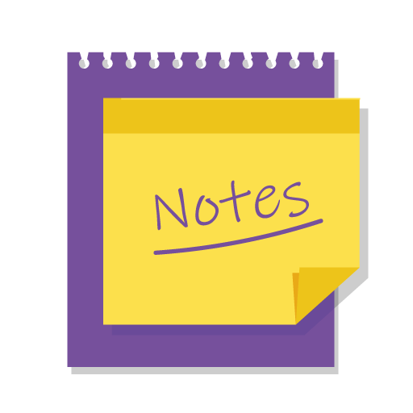
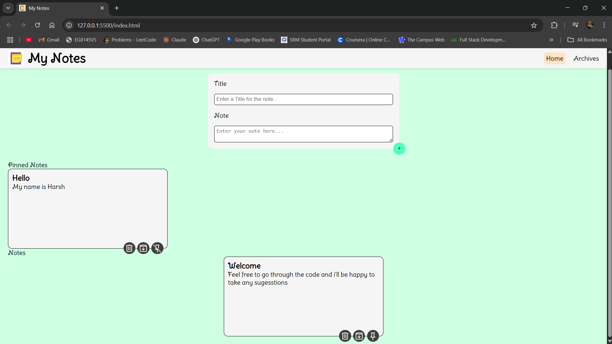

# 📝 My Notes

> A simple and elegant note-taking web app built using **HTML**, **CSS**, and **JavaScript** to help you take, pin, archive, and manage your thoughts easily.



---

## 📌 Introduction

**My Notes** is a responsive and interactive web app created as part of my journey to learn front-end web development. The goal was to build something functional while practicing **HTML**, **CSS**, and **Vanilla JavaScript** — no frameworks involved!

---

## ✨ Features

✅ Add notes with title and content  
📌 Pin/unpin important notes  
🗃️ Archive and unarchive notes  
🗑️ Delete notes permanently  
📂 View archived notes on a separate page  
📱 Responsive design for mobile and tablet  
💾 Data stored using `localStorage` (no backend required)

---

## 📷 Screenshots

### 🏠 Home Page  


### 📌 Pinned & Unpinned Notes  


### 🗃️ Archive Page  


> _Place your screenshots in a folder named `screenshots` inside your project directory. Make sure to use relative paths like `./screenshots/home.png`._

---

## 🚀 Technologies Used

- HTML5  
- CSS3  
- JavaScript (ES6+)  
- LocalStorage API  
- Responsive Design  
- Custom Icons from `Assets` folder

---

## 🛠️ How to Run the Project Locally

1. Clone the repository:
   ```bash
   git clone https://github.com/yourusername/my-notes.git
   cd my-notes

2. Or you can directly access the website at
   https://harsh-sriv.github.io/My-Notes/
